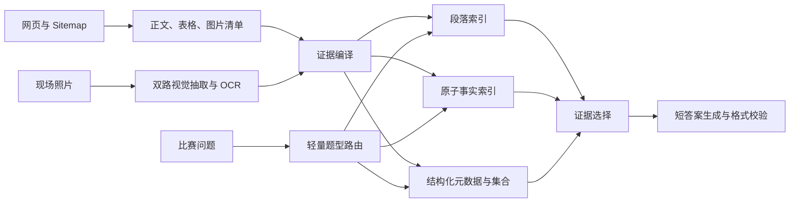

# InnoWing Chatbot Challenge 2026 取胜策略研究

## 结论

当前项目还处于“Workshop 基线”而不是“可提交产品”阶段。真正的提交目录 `submission_repo/` 没有 `data/`，抓取、图像处理和复杂问题处理仍有多处 TODO。继续只在 Lab Notebook 中调 `k` 或 Prompt，不会直接提高最终提交的分数。

最有胜算的路线是构建一个**离线证据编译器**：赛前把网页、表格、网站图片和现场照片转换为带来源、实体、年份、类型和空间信息的事实；比赛时根据题型选择检索、过滤、聚合或分解，最后只输出短答案。

取胜重点分两轮：

- 初赛：先把 Lv1 和 Lv2 做到接近满分，再用 Lv3 拉开差距。课件明确说明 Lv1 与 Lv2 合计覆盖初赛 60%，Lv3 覆盖另外 40%。
- 决赛：把 Lv3 的图像管线迁移到现场照片，同时用结构化元数据解决 Lv4 的计数、比较和汇总。Lv5 的主要竞争优势来自数据覆盖和拍摄质量，而不是更复杂的 Prompt。

需要向主办方确认一次决赛比例。`W0_Setup_and_Rules.pptx` 第 4 页的 Final 数字合计超过 100%，而 `W2_Visual_and_Physical_Data.pptx` 第 2 页又说只处理 Lv1/Lv2 的机器人覆盖不了决赛。执行上应采用更保守的假设：初赛集中 Lv1 至 Lv3，晋级后集中 Lv3 至 Lv5。

## 一、当前项目审计

| 模块 | 当前状态 | 对比赛的影响 |
| --- | --- | --- |
| 评分入口 | `main.py` 合约完整，每题限制 30 秒 | 可以保留，不应修改 |
| 实际提交数据 | `submission_repo/data` 不存在 | 当前提交没有可检索知识，无法形成有效分数 |
| 网页抓取 | `SITES` 为空，内部链接遍历未实现，正文仍使用整个 `soup` | 真实网站尚未进入系统；导航和页脚会污染检索 |
| 文本索引 | 固定 800/100 切块，缺少 `year`、`page_type` 等元数据 | 能作为基线，但无法可靠处理表格、计数和过滤 |
| 图片管线 | 描述 Prompt 仍是 TODO | Lv3 与 Lv5 的理论上限目前接近零 |
| 问答逻辑 | 固定 `k=5` 的单路向量检索 | 没有混合检索、路由、分解、聚合和输出校验 |
| 批量回答 | 顺序调用；任意一个异常可能让整个 batch 失败 | 隐藏的稳定性风险 |
| 评估 | Lab 日志记录了 9/15 检索命中，但提交目录没有同等评估工具 | Notebook 的实验结果没有迁移到最终产品 |
| API 实验 | 最近一次 Lab 输出是 `UnicodeEncodeError`，不是可用基线 | 当前 `correct=0` 不能用来判断参数优劣 |

因此，当前第一瓶颈不是模型、Prompt 或 Chroma 参数，而是**真实数据尚未进入提交系统**。

## 二、取胜系统的核心设计



### 1. 多表示索引

同一份资料至少保存三种表示：

- 段落块：保留上下文，适合普通事实问答。
- 原子事实：一条记录只表达一个事实，例如“MakerSpace A | capacity | 40”。适合精确检索、数字和专有名词。
- 结构化记录：表格行、活动、设备、场地、图片和现场对象。适合计数、比较和筛选。

每条记录都保存证据原文和来源，避免模型在构建阶段生成无法验证的事实。模型抽取的事实只有在原文、OCR 文本或图片描述中能找到对应证据时才进入索引。

### 2. 小块检索，大块回答

使用较小的 heading-aware 子块生成向量，提高定位精度；返回答案时，把相邻段落或父章节一并交给模型。这比在“精确的小块”和“有上下文的大块”之间硬选一个更稳。

建议起点：

| 类型 | 建议策略 |
| --- | --- |
| 正文 | 按标题、段落、句子递归切分，约 400 至 700 字符 |
| 表格 | 每行一条结构化记录，同时保留表头 |
| 图片文字 | OCR 结果按图片和区域保存，不与场景描述混成一大段 |
| 图片场景 | 对象、数量、位置和颜色单独保存 |
| 父上下文 | 保存章节或页面级文本，检索命中后按 `parent_id` 返回 |

### 3. 混合检索

只用向量检索容易错过人名、队名、设备型号、年份和标牌原文。建议同时运行：

- Dense retrieval：解决同义词和语义改写。
- BM25 或其他本地关键词检索：解决专有名词、数字、代码和精确文字。
- Reciprocal Rank Fusion：合并两组排名。
- 可选的二次筛选：先取 20 至 40 条候选，再通过本地规则或一次网关调用选出最有证据的 5 至 8 条。

混合检索应该在文本基线稳定后加入。没有干净语料时，增加检索算法只会更稳定地检索到脏数据。

### 4. 题型路由

不要让每道题都走同一条昂贵链路。

| 题型 | 识别信号 | 路径 |
| --- | --- | --- |
| 通用知识 | 不包含 InnoWing 专属实体，答案属于常识 | 直接模型回答，保持简短 |
| 单一网页事实 | 一个实体、一个属性 | 混合检索后回答 |
| 图片事实 | `shown`、`photograph`、颜色、墙面文字、位置关系 | 优先过滤 `kind=image_*` |
| 复合问题 | 两个主体、比较、多个事实要求 | 拆成子问题，并行检索后合并 |
| 计数/最大值 | `how many in total`、`most`、`at least` | 元数据过滤和程序聚合，不让模型凭 top-k 猜 |
| 现场事实 | 房间方位、墙面、门牌、设备数量 | 优先过滤现场照片和指定区域 |

路由优先使用规则。只有规则无法判断时才调用一次分类模型，避免每题固定增加一次模型延迟。

## 三、初赛策略

### Lv1：消除不必要的检索干扰

通用知识题不一定需要 RAG。当前实现会给所有问题塞入五条检索结果，可能让错误或无关上下文覆盖模型原本知道的答案。

建议同时生成两个候选：闭卷答案和检索答案。根据检索证据是否明确选择其中一个。若需要模型仲裁，给仲裁器看问题、两份答案和证据，只要求选择最终短答案。

内部目标：Lv1 题正确率 95% 以上，输出格式错误为零。

### Lv2：先保证证据覆盖，再调 Prompt

Lv2 的主要工作顺序：

1. 抓全两个网站。
2. 只提取正文，不索引重复导航、页脚和 Cookie 文本。
3. 对 URL、正文哈希和规范化标题去重。
4. 单独处理表格、FAQ、活动列表和设备规格。
5. 先测 retrieval hit@k，再测最终答案。

如果标准答案没有出现在候选证据里，继续改 Prompt 没有意义。

内部目标：Lv2 retrieval hit@10 达到 95% 以上，最终正确率达到 90% 以上。

### Lv3：最可能决定能否进入前五

所有团队都能照课件完成基础文本 RAG，因此 Lv1/Lv2 很可能只能形成基本盘。图像处理更容易产生分差。

每张图片至少运行两条独立管线：

- 场景抽取：区域名称、对象、准确数量、材料、颜色、空间关系。
- 文字抽取：所有可见文字逐字抄录，无法辨认时输出 `[unreadable]`。

再并行运行本地 OCR。视觉模型负责语义和空间，OCR 负责精确文字。对海报、标牌和大图做重叠切片，避免缩放后小字消失。

图片缓存应使用以下组合键，而不是只用 URL：

```text
image_sha256 + prompt_version + model + tile_coordinates
```

当前 `images.py` 使用没有扩展名的临时文件，并且缓存只按 URL。建议保存原始后缀、检查 HTTP 状态和 MIME 类型，同时使构建过程可以安全重跑。

内部目标：网站图片清单覆盖率 100%，抽样图片描述字段完整率 95%，Lv3 自建盲测正确率达到 70% 以上。

## 四、决赛策略

### Lv4：把“推理”尽量变成数据库操作

计数、比较和总量问题不适合依赖 top-k。无论向量模型多强，`k=5` 都看不到第六项。

在构建阶段为每条记录增加：

```text
kind, page_type, year, entity_type, entity_name,
location, zone, source_url, parent_id, image_id
```

运行时先过滤完整集合，再由 Python 计数、排序或比较。只有需要自然语言合成时才调用模型。对于多主题问题，将独立子查询并行执行，控制总时间。

### Lv5：数据采集能力是护城河

模型无法恢复没有拍到的事实。现场采集应围绕“覆盖率和可辨认度”设计：

- 每个区域拍一张全景，用于确定位置和空间关系。
- 每面墙、门、设备和标牌拍正面近照。
- 计数对象使用有重叠的分区照片，避免遗漏或重复。
- 文件名包含区域、方向、对象和序号。
- 保存拍摄清单、覆盖矩阵和需要补拍的失败题。
- 第一轮索引后立即自拟问题，再进行第二次定向补拍。

建议把现场资料保存成结构化清单，例如：

```json
{
  "zone": "makerspace-a",
  "surface": "east-wall",
  "object": "tool-locker",
  "count": 6,
  "colour": "blue",
  "visible_text": [],
  "photo_ids": ["MSA_EAST_01", "MSA_EAST_02"]
}
```

这个结构既能回答“什么颜色”，也能支持“有多少个”和“位于哪面墙”。

## 五、回答质量与运行可靠性

### 输出控制

比赛按准确和完整评分，额外错误信息会把 1 分变成 0.5 分。输出层应根据问题类型校验：

- 数量题提取最终数字和必要单位。
- 列表题保留所有项目，删除解释性前缀。
- exact-text 题保持大小写和原始词序。
- 日期统一成资料中的表达形式。
- 永远不要返回“我不知道”；证据不足时仍给最佳短答案。

### 异常隔离

当前 `rag_answer_batch` 是列表推导式。如果其中一题抛异常，`main.py` 会捕获整个调用并给所有题输出空字符串。应在 batch 内逐题捕获异常，保证一题失败不影响其他题。

### 时间预算

建议把正常路径控制在 10 秒内，复杂路径控制在 20 秒内，并在约 24 秒时停止额外步骤，使用已有最佳证据生成答案。至少记录 p50、p95 和最慢耗时，不能只看平均值。

运行时还应缓存一次打开的 Chroma collection，批量嵌入多个问题，并行执行独立子查询，避免每题重复初始化数据库。

## 六、真正有效的评估体系

15 道公开 dev 题不足以支持调参。一道题约占 6.7%，偶然答对一题会制造虚假进步。

建议建立 60 至 100 道内部题库：

- 按 Lv1 至 Lv5 和数据来源标注。
- 单独标记答案类型：数字、日期、列表、exact text、比较。
- 保存 gold answer、可接受变体、证据来源和证据片段。
- 划分开发集与盲测集。负责实现的人不能提前查看盲测答案。
- 加入相似实体、同名房间、边界切块、导航污染、错误年份等对抗题。

每次实验记录：

| 指标 | 作用 |
| --- | --- |
| 数据覆盖率 | 资料是否已经进入系统 |
| retrieval hit@5 / hit@10 | 正确证据是否被找到 |
| 最终正确 / 部分正确 | 对应比赛分数 |
| exact-text accuracy | 检查标牌、队名和 OCR |
| p95 latency | 防止少量题超过 30 秒 |
| error rate | 检查网络、解析、索引和批处理稳定性 |
| format violations | 检查多余解释、空答案和多行输出 |

每轮只改一个变量，保留所有实验行和失败题。失败题列表比总分更适合作为开发任务队列。

## 七、建议执行顺序

### 16 至 18 September：提交版基线

1. 获得并确认两个目标网站 URL。
2. 完成 `scrape.py`，生成真实的 `pages.json` 与 `images.json`。
3. 清洗正文、去重、解析表格，保存原始快照和抓取报告。
4. 完成第一版真实索引。
5. 建立提交目录自己的 `evaluate.py`，不再用 Lab 代替提交测试。

完成标准：`python main.py "question"` 能从真实索引回答，Lv1/Lv2 不再是零分。

### 19 至 23 September：稳定 Lv1/Lv2

1. heading-aware 与 parent-child 切块。
2. 加入 BM25 与向量融合。
3. 完成短答案格式校验。
4. 构造至少 30 道文本盲测题。
5. 逐题记录证据命中和耗时。

完成标准：文本 retrieval hit@10 超过 95%，p95 小于 15 秒。

### 24 September 至 4 October：建立 Lv3 优势

1. 图片去重和来源追踪。
2. 双 Prompt 视觉抽取。
3. 本地 OCR 与大图切片。
4. 对 `prompt_version` 和图片哈希建立缓存。
5. 构造 exact-text、计数、颜色和空间关系盲测题。

完成标准：每个失败题都能明确归类为“没收集、没描述、描述缺字段、没检索到或答案生成错”。

### 5 至 14 October：Lv4 与现场数据

1. 完成实体、年份、类型、区域和墙面方向等元数据。
2. 用 Python 处理计数、最大值和比较。
3. 完成第一轮现场拍摄和覆盖矩阵。
4. 根据失败题进行第二轮补拍。

### 15 至 20 October：冻结与提交演练

1. 在全新虚拟环境从零安装。
2. 在禁止网站访问的条件下运行完整题库。
3. 确认 `data/chroma` 已提交，`.env` 未提交。
4. 检查 stdout 只有答案。
5. 测试单题和 batch 调用、异常隔离和 30 秒限制。
6. 冻结依赖和索引版本，不再进行未经盲测的临时改动。

## 八、投入优先级

| 优先级 | 工作 | 原因 |
| --- | --- | --- |
| P0 | 真实网站抓取、清洗和提交索引 | 当前没有提交数据，其他优化没有基础 |
| P0 | 提交版评估工具与盲测集 | 没有它就无法判断改动是否有效 |
| P1 | 图片双路抽取、OCR、切片 | 初赛最可能形成分差的 40% |
| P1 | 元数据和结构化事实 | 同时支持 Lv2 精确检索、Lv4 聚合和 Lv5 现场信息 |
| P1 | 混合检索与 parent-child | 对专有名词和上下文完整性有直接收益 |
| P2 | 路由、并行分解和聚合 | 决赛重要，但应建立在完整数据上 |
| P2 | 输出校验、异常隔离、超时降级 | 防止已经答对的题因工程问题丢分 |
| P3 | 大型本地 reranker 或复杂 Agent | 依赖体积和延迟风险高，只有盲测证明有增益时才保留 |

## 九、不建议的方向

- 在真实索引尚不存在时继续反复改 Prompt。
- 把所有问题都交给多步 Agent 或统一做问题分解。
- 在回答阶段下载网页、读取图片或重新生成图片描述。
- 只用 top-k 向量结果回答计数题。
- 只按 URL 缓存图像描述，导致 Prompt 更新后仍读旧结果。
- 用公开 15 题反复调参并把分数当作泛化能力。
- 为了追求高级算法而引入无法随提交离线安装的大型模型。
- 手工硬编码公开问题的答案。它不能覆盖隐藏题，也无法证明系统有效。

## 十、建议的胜负指标

在提交前，系统至少达到以下内部门槛：

| 指标 | 建议门槛 |
| --- | --- |
| 抓取成功率 | 目标页面 100%，失败 URL 有明确日志 |
| 重复/导航污染 | 抽样 30 页无明显重复菜单和页脚 |
| Lv1 正确率 | 95% 以上 |
| Lv2 retrieval hit@10 | 95% 以上 |
| Lv2 最终正确率 | 90% 以上 |
| Lv3 盲测正确率 | 70% 以上，并持续提高 |
| exact-text 正确率 | 85% 以上 |
| p95 耗时 | 15 秒以内 |
| 超时和空答案 | 0 |
| 清洁环境复现 | 一次完整通过 |

这些是内部工程目标，不是主办方公布的晋级线。它们的作用是让团队知道何时应该停止调参，转向新的分数来源。

## 最重要的三件事

1. 把两个真实网站的 URL 和现场区域资料补齐，这是目前最大的外部依赖。
2. 在 `submission_repo` 完成真实 scraper、index 和评估闭环，停止把 Lab 结果当成提交进度。
3. 尽早建立双路图像抽取与 OCR，因为 Lv3 是初赛最可能决定前五名的部分，而同一能力会直接复用于决赛 Lv5。

## 本地依据

- `Slides/W0_Setup_and_Rules.pptx`：比赛入口、30 秒限制、初赛与决赛、评分规则。
- `Slides/W1_RAG_Pipeline.pptx`：检索、混合搜索、切块、索引和实验方法。
- `Slides/W2_Visual_and_Physical_Data.pptx`：图像抽取、OCR、问题分解、元数据过滤和现场数据。
- `Labs/Notebook_Guide.md` 与 Lab 1 至 Lab 5：Workshop 方法及其与提交目录的边界。
- `submission_repo/`：当前实际可提交代码状态。

