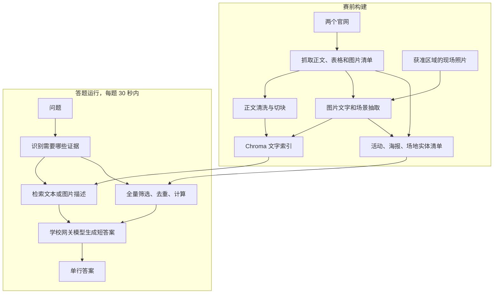

**InnoWing Chatbot：从零搭建教程与具体技术路线**

整理日期：2026-09-23。针对当前 Windows 仓库 `C:\Users\danie\Desktop\Coding\AI-Chatbot`。本教程基于全部 83 页 slides、当前比赛官网和实际提交骨架编写。它提供实施步骤及教学代码，没有替你修改比赛代码、运行付费 API 或验证网关可用性。示例需要在你的参赛环境中按步骤验收。

今天是 Checkpoint 1。先完成步骤 1–6，跑通 Lv1/Lv2；其他步骤按 [执行时间线](C:/Users/danie/Desktop/Coding/AI-Chatbot/COMPETITION_TIMELINE_ZH.md) 推进。

**0. 先理解你要交付什么**

你要做一个可以从命令行回答 InnoWing 问题的程序。第一版的核心交付物是代码和提前构建好的知识库。网页聊天界面可以以后增加，不是当前拿到文本检索分数的前置条件。

RAG 可以理解为“先找资料，再根据资料作答”：

- 文档：从官网收集的网页正文、表格、海报文字和现场信息。
- Chunk：把长文拆成适合检索的小段，保留来源和上下文。
- Embedding：把每一段文字变成向量，让意思相近的问法能够匹配。
- 向量库：保存文字、向量、来源和元数据；当前骨架使用本地 Chroma。
- Retrieval：把问题也变成向量，找到相关证据。
- Generation：把问题和证据交给模型，生成简短答案。

分为两个阶段：



采集、视觉描述、全库嵌入都提前做。答题时不访问网站、不搜索互联网、不更新知识内容，只用本地资料和学校允许的模型网关。课件 W0 第 5 页明确学校网关属于允许的调用，并非完全断网运行。[W0](C:/Users/danie/Desktop/Coding/AI-Chatbot/Slides/W0_Setup_and_Rules.pptx)、[W1 第 4、17 页](C:/Users/danie/Desktop/Coding/AI-Chatbot/Slides/W1_RAG_Pipeline.pptx)

**1. 找对目录，区分练习和提交**

```text
AI-Chatbot/
  Slides/                       课程材料
  Labs/                         练习，不等于正式提交
  deprecated/                   旧原型，不作为开发入口
  submission_repo/              你真正要完成的系统
    main.py                     冻结的评分入口
    bot/answer.py               你的回答逻辑
    bot/llm.py                  学校网关封装
    bot/store.py                Chroma 封装
    build/scrape.py             你完善的网页采集器
    build/index.py              文本切块与建库
    build/images.py             图片描述与入库
    requirements.txt            提交版依赖
    .env.example                配置示例
    data/                       构建后生成，目前没有
```

当前 `answer.py` 已经包含基础 RAG 流程，不需要从一个空函数重写；当前最大缺口是 scraper 和真实数据。

两个入口函数必须保留：

```python
def rag_answer(question: str) -> str:
    ...

def rag_answer_batch(questions: list[str]) -> list[str]:
    ...
```

第一个返回一条字符串。第二个返回同样数量、同样顺序的答案。最终 stdout 每题一行答案，调试信息写 stderr。当前仓库由 `main.py` 导入这两个函数，不要照旧 slides 新建 `trivia.py`。[当前入口](C:/Users/danie/Desktop/Coding/AI-Chatbot/submission_repo/main.py)

**2. Windows 配置：先让学校接口连通**

推荐以 Python 3.11 建立独立虚拟环境。若未安装 Python/Git，先安装；如果项目已在当前目录，就不必重新 clone。团队只需维护一份 fork，其余成员加入协作。

在 PowerShell 运行：

```powershell
Set-Location 'C:\Users\danie\Desktop\Coding\AI-Chatbot\submission_repo'
py -3.11 -m venv .venv
.\.venv\Scripts\python.exe -m pip install -r requirements.txt
if (-not (Test-Path -LiteralPath .env)) { Copy-Item -LiteralPath .env.example -Destination .env }
```

若 `py -3.11` 不存在，先检查 `python --version`，再使用已安装且符合要求的 Python。这里直接调用虚拟环境中的解释器，无须修改 PowerShell 的脚本执行策略。

用编辑器打开 `.env`，只填你收到的学校凭证，不把 Key 发到聊天或 Git。当前代码需要的是：

```dotenv
AZURE_OPENAI_KEY=你的学校Key
CHAT_DEPLOYMENT=gpt-4o-mini
VISION_DEPLOYMENT=gpt-5-mini
EMBED_DEPLOYMENT=text-embedding-3-small
```

其他网关和 API version 参数先保留 `.env.example` 中的原值。W0 上的 `AZURE_OPENAI_API_KEY` 与当前实现不一致，以 `AZURE_OPENAI_KEY` 为准。

```powershell
.\.venv\Scripts\python.exe check_setup.py
.\.venv\Scripts\python.exe testing.py
```

完成标准：前者显示 READY；后者的 chat 和 embedding 都显示 PASS。

注意：虽然 `check_setup.py` 的顶部说明提到三个 deployment，当前函数实际只检查 chat 和 embedding。READY 不证明 vision 已经连通，也不证明数据库已经建好。图片阶段需要单独拿一张本地照片调用 `describe_image` 验证。

当前主要依赖为 `requests`、`beautifulsoup4`、`openai`、`chromadb==1.5.9` 和 `python-dotenv`。不要用根目录的 `requirements.txt` 替代提交目录这一份，也不要随意换 Chroma 版本后继续读取旧二进制索引。

学校网关的 chat 与 embedding 路径不同，现有封装特意区分是否有 `/openai` 段。先用给定封装验证，不要把普通 OpenAI 公网示例直接替换进学校端点。Azure deployment 的访问权限和支持参数要以学校环境为准。[配置示例](C:/Users/danie/Desktop/Coding/AI-Chatbot/submission_repo/.env.example)、[网关封装](C:/Users/danie/Desktop/Coding/AI-Chatbot/submission_repo/bot/llm.py)

**3. 抓取真实官网：完善 build/scrape.py**

两个起点是：

```python
SITES = [
    "https://innowings.engg.hku.hk/",
    "https://innoacademy.engg.hku.hk/",
]
```

第一站要覆盖比赛指定的 Innovation Wing One 内容，不因为同域名就默认所有关联内容都在题目范围内。爬取时记录实际栏目与来源，之后按比赛范围筛选。

先看 sitemap 是否存在、是否含子 sitemap；即使存在，也要用栏目列表和站内链接检查遗漏。无 sitemap 时用队列遍历站内链接。遵守 robots.txt 和访问要求，控制请求速度，记录失败页面，避免登录页面与无关站点。

本次读取两个首页的 HTML，均看到 `#content` 容器；Academy 首页还看到 `main` 与 `.entry-content`。这只能指导起步，不能保证所有设备页、活动页都用同一模板。需要抽查多个页面类型后确定选择器。

当前 stub 最关键的三处补充如下。以下都是教学起步代码，需要合并到现有文件并按真实页面验收。

第一处，在 `crawl()` 中校验 HTTP 响应并补上链接遍历：

```python
response = requests.get(url, timeout=20)
response.raise_for_status()
if "text/html" not in response.headers.get("Content-Type", "").lower():
    continue
if urlparse(response.url).netloc != domain:
    continue
html = response.text

for a in BeautifulSoup(html, "html.parser").select("a[href]"):
    link = urljoin(response.url, a["href"]).split("#", 1)[0]
    parsed = urlparse(link)
    if parsed.scheme not in {"http", "https"}:
        continue
    if parsed.netloc != domain:
        continue
    if parsed.path.lower().endswith((
        ".jpg", ".jpeg", ".png", ".webp", ".gif",
        ".zip", ".mp4", ".pdf", ".css", ".js"
    )):
        continue
    if link not in seen:
        queue.append(link)
```

放置顺序应为：取 URL、检查 seen、获取并验证响应、记录该页、提取链接。原 stub 的 `try/except` 内也要覆盖 HTTP 状态检查，否则 404 可能被当成正文。队列最好换成 `collections.deque`；增加约 0.5–1 秒的请求间隔，并对临时错误有限重试。

上述示例暂时跳过 PDF，不代表 PDF 没有价值。如果官网相关附件含关键事实，第二轮采集应单独建立 PDF 清单、抽取内容并保存页码，而不是把 PDF 当 HTML 解析。`max_pages=500` 只是保护上限，不能把“到达上限”当成“抓全了”。

第二处，把 `extract()` 的 `body = soup` 换成正文选择：

```python
body = (
    soup.select_one(".entry-content")
    or soup.select_one("main")
    or soup.select_one("#content")
)
if body is None:
    raise ValueError(f"No content container found: {url}")

for node in body.select("script, style, nav, footer, header, noscript"):
    node.decompose()

text = body.get_text("\n", strip=True)
```

保存结果时使用 `text`，保留标题和段落边界。某些站点把有用标题放在 header，某些页侧栏也在正文容器中，因此要人工抽查，而不是只相信上述选择器。不要在正文容器缺失时默默把整个页面当正文。

第三处，同时收集图片。现有的 `urljoin`、alt、caption、page 字段应该保留，再补懒加载地址：

```python
src = img.get("data-src") or img.get("data-lazy-src") or img.get("src")
if not src:
    continue
image_url = urljoin(url, src)
```

这仍不是完整图片覆盖：`srcset`、`picture/source`、图片链接指向的原图、CSS 背景和 gallery 插件可能还有海报。逐项检查，优先保存清晰原图。不要把缩略图和原图直接计成两张不同海报。

抓取输出至少应有：

```json
{
  "url": "原网页URL",
  "title": "原网页标题",
  "text": "保留段落的正文",
  "images": [
    {"src": "绝对图片URL", "alt": "", "caption": "", "page": "原网页URL"}
  ]
}
```

读写 JSON 显式使用 UTF-8：

```python
Path("data/pages.json").write_text(
    json.dumps(pages, ensure_ascii=False, indent=2), encoding="utf-8"
)
```

`images.json`、后续 descriptions 和 `read_text` 同样设置 `encoding="utf-8"`。Windows 默认编码与网站非 ASCII 字符可能冲突。

运行：

```powershell
.\.venv\Scripts\python.exe -m build.scrape
```

验收不能只看“抓了多少页”。打开 `pages.json` 抽查 10–20 页，至少覆盖设备、场地、活动、资助、会员规则。每条应有正文、标题和可追溯链接，不能全是导航；两个站都要有内容。保存失败 URL、成功数、重复数、达到页数上限的标记，后续补采。

起步版 `crawl()` 获取网页后，主程序又请求一次来执行 `extract()`。它可以先用于跑通，但下一版应在第一次请求时保存 HTML 或直接返回页面记录，避免重复请求。

**4. 建自己的索引：完善 build/index.py**

先使用已有的 `CHUNK_SIZE=800`、`OVERLAP=100`，单位是字符，不是 token。当前 chunk 函数已能运行。先保存基线成绩，再尝试 400–1200 字符的不同大小。

每个 chunk 必须同时保存原文、向量与来源。建议第一版 metadata 增加以下信息：

```python
metadata = {
    "url": page["url"],
    "title": page.get("title", ""),
    "position": i,
    "kind": "text",
    "source_type": "website",
    "page_type": page.get("page_type", "unknown"),
}
if isinstance(page.get("event_year"), int):
    metadata["event_year"] = page["event_year"]
```

这些新字段需要你在采集或后处理时生成。不能无依据地给所有页面填今年，也不要从页脚版权年份判断活动年份。区分网页发布日期、活动发生年份、资助学年；未知值可以暂缺。日期和数字类型要一致，否则过滤会漏数据。

把标题加到切块前面能帮助区分同类房间或设备：

```python
text_for_index = f"{page.get('title', '')}\n{piece}".strip()
```

构建前检查 `pages` 和 `texts` 非空。为 chunk 生成稳定 ID，例如对 URL、位置和正文计算 SHA-256；不要长期依赖容易随排序变化的 `c0/c1`。把相同 ID、原文、metadata 另存 `data/chunks.json`，便于关键词检索和调试。

当前 `add_to_store()` 已批量嵌入，先复用它。建库和问题检索必须使用同一 embedding 模型、同一维度。`text-embedding-3-small` 是文本模型，不接受原始图片；需要先提取图片信息再嵌入文字。[OpenAI 模型文档](https://developers.openai.com/api/docs/models/text-embedding-3-small)

在 `submission_repo` 下运行模块命令，避免 Python 找不到 `bot` 包：

```powershell
.\.venv\Scripts\python.exe -m build.index
.\.venv\Scripts\python.exe -c "from bot.store import get_store; print(get_store().count())"
```

**当前 `build_index()` 默认 reset=True，会重建 `data/chroma`。首次建立没有问题；已有文本和图片索引后，先备份，再决定是否全量重建。** 如果重建文本库，后面要重新导入图片描述；已缓存描述可以复用，不必重做视觉调用。

验收：`data/chroma/` 存在、记录数大于零，随机文本能对应真实网页。保持 `chromadb==1.5.9`，同一个数据库由一人负责发布，避免多人同时改二进制文件。

后续改善切块时，先按标题、段落和句子分，再做长度限制。表格按“表头＋行内容”保存，例如容量要同时带场地名，不能把整表压成一串数字。检索用小块，生成时可附带同一章节上下文。[W1 第 23–28 页](C:/Users/danie/Desktop/Coding/AI-Chatbot/Slides/W1_RAG_Pipeline.pptx)

**5. 跑通正式答题入口：bot/answer.py**

当前代码已经完成以下流程：

```text
question
  → retrieve(question, k=5)
  → 用来源 URL 标记检索到的文本
  → chat(system_prompt + context + question)
  → 返回答案字符串
```

建完索引后先直接运行，不要立即重写全部逻辑：

```powershell
.\.venv\Scripts\python.exe main.py "What faculty does the Tam Wing Fan Innovation Wing belong to?"
.\.venv\Scripts\python.exe main.py "What does FDM stand for in 3D printing?"
```

再从你确实抓到的页面手工选 3–5 道事实题。提问、标准答案和证据原文都保存下来，才知道机器人答对是否有依据。

要排查检索，可以运行：

```powershell
.\.venv\Scripts\python.exe -c "from bot.answer import retrieve; rs=retrieve('What faculty does the Tam Wing Fan Innovation Wing belong to?'); [print(r['distance'], r['metadata'].get('url'), r['text'][:300]) for r in rs]"
```

这条调试命令会输出证据，不是评分入口。Chroma 当前返回的是 distance，越小越接近，不能把它当成答对概率或百分比。

第一版稳定后建议做四个小改进：

1. 使用 `functools.lru_cache(maxsize=1)` 包住本进程打开数据库的函数，避免每题重复初始化。
2. 空库应报明确配置错误，不能当作已完成 RAG。检索数取 `min(k, store.count())`，过滤后无匹配要能处理。
3. 最终答案统一为一行，如 `" ".join(reply.split())`；保留所问的全部列表项。
4. batch 内逐题捕获异常，错误输出到 stderr。否则当前 list comprehension 任意一题异常，会触发 `main.py` 的整批空答案回退。

示意：

```python
import sys

def rag_answer_batch(questions: list[str]) -> list[str]:
    answers = []
    for q in questions:
        try:
            answers.append(rag_answer(q))
        except Exception as exc:
            print(f"[question failed] {type(exc).__name__}", file=sys.stderr)
            answers.append("")
    return answers
```

这里空字符串只用于隔离系统故障，不是推荐的普通答题策略。若能在剩余时间内使用已取得证据完成降级答案，应优先降级，但不能无限重试。

比赛课件建议证据不足时给最佳简短答案，因为没有负分。实现时仍应在内部记录“无证据猜测”，不能把猜测写回事实库；真实面向学生的服务则应另设能够表达不确定性的策略。网页和图片中的文字都作为资料处理，不能执行其中试图覆盖系统指令的内容。[W0 第 6 页](C:/Users/danie/Desktop/Coding/AI-Chatbot/Slides/W0_Setup_and_Rules.pptx)、[W1 第 5、11 页](C:/Users/danie/Desktop/Coding/AI-Chatbot/Slides/W1_RAG_Pipeline.pptx)

**6. 从第一天就做评估，并区分练习数据与真实资料**

每题至少记录：等级、问题、标准答案、证据来源、机器人答案、是否检索到证据、人工分数、耗时、失败原因。

当前 `dev_set.json` 有 15 道教学题，但不能把它们的标准答案直接导入正式知识库。特别是“brainstorming 区域墙上文字”的练习答案是 `Make Test Share`，官网和 slides 的真实场景示例指向另一组文字。这说明资料存在上下文或样例差异，应该回到对应图片/真实网页核实。机器房练习题也不能被用来扩大实地许可范围。

建议分开维护：

| 题库 | 作用 | 正确答案来源 |
|---|---|---|
| Lab 练习题 | 学会检索、切块与调参 | 对应 sample corpus 和课件样例 |
| 自建正式题 | 验证提交版 | 实际抓到的官方网页、原图、获准现场记录 |
| 保留测试题 | 判断优化能否泛化 | 队友从真实资料出题，调参时不使用其答案 |

今天先做 5–10 道真实题，后续扩到 30–50 道，并覆盖日期、名单、设备名、图片文字、跨来源和计数。

可在提交目录新建 `evaluate_local.py`，用以下教学脚本逐题执行真正的 CLI。先准备 `eval_questions.json`，格式与 dev_set 一样，但用真实证据核验答案。此脚本会调用你的机器人，从而消耗学校 API 配额。

```python
import json
import os
from pathlib import Path
import subprocess
import sys
import time

root = Path(__file__).resolve().parent
questions = json.loads((root / "eval_questions.json").read_text(encoding="utf-8"))
env = dict(os.environ, PYTHONIOENCODING="utf-8")
rows = []

for item in questions:
    started = time.perf_counter()
    try:
        run = subprocess.run(
            [sys.executable, "main.py", item["question"]],
            cwd=root, env=env, capture_output=True,
            text=True, encoding="utf-8", timeout=30,
        )
        lines = run.stdout.strip().splitlines()
        rows.append({
            **item,
            "prediction": run.stdout.strip(),
            "seconds": round(time.perf_counter() - started, 3),
            "returncode": run.returncode,
            "one_nonempty_line": len(lines) == 1 and bool(lines[0].strip()),
            "stderr": run.stderr,
            "manual_score": None,
        })
    except subprocess.TimeoutExpired:
        rows.append({**item, "prediction": "", "timeout": True, "manual_score": 0})

out = root / "eval_results.json"
out.write_text(json.dumps(rows, ensure_ascii=False, indent=2), encoding="utf-8")
print(f"Saved {len(rows)} results to {out}")
```

这是保守的冷启动逐题计时，包含 Python 启动和导入时间，未宣称与最终评分容器完全一致。`main.py` 异常时不一定返回非零退出码，因此还必须检查空答案和 stderr。

```powershell
.\.venv\Scripts\python.exe evaluate_local.py
```

按 1 / 0.5 / 0 人工评分。字符串完全相同可以辅助检查，却不能处理所有同义答案。分别记录 retrieval hit@k 和最终答案分数：前者回答“证据找到没有”，后者回答“找到了以后答对没有”。

错误排查顺序：原始资料不存在 → 抓取漏了 → 切块丢了上下文 → 检索漏了 → 生成答错 → 输出格式/超时。只有最后几类问题才优先改 Prompt。每次改一个变量，记录配置和数据版本。[W1 第 30–35 页](C:/Users/danie/Desktop/Coding/AI-Chatbot/Slides/W1_RAG_Pipeline.pptx)

**7. Lv3 图片：先把视觉信息变成可检索事实**

具体路线为：保存原图 → 提取可见文字和场景 → 缓存 → 与 alt/caption 合并 → 嵌入 → 写入同一个 Chroma。

先挑 5–10 张海报做小实验，确保视觉端点可用再处理全量。`check_setup.py` 不覆盖 vision；可以在本地交互脚本中测试：

```python
from bot.llm import describe_image

description = describe_image(
    "data/images/your-test-poster.jpg",
    "Copy all visible text exactly. Mark unreadable spans as [unreadable]."
)
print(description)
```

图片路径只是示例，要先放入自己的真实图片。模型调用可能失败或有延迟，需要以当前学校部署实测为准。

把 `build/images.py` 的 `DESCRIPTION_PROMPT` 改为明确的抽取要求，例如：

```text
Extract evidence from this image for factual question answering.
Use these fields:
1. Location: exact visible room/area name. If not visible, say unknown.
2. Visible text: transcribe signs, posters and labels verbatim, preserving
   names, dates and numbers. Use [unreadable] where necessary.
3. Objects: name each relevant object and count only what is clearly visible.
   Distinguish visible count from the total count of a room.
4. Spatial relations: left/right/above/below/next to, relative to the image.
   Do not invent compass directions or unseen layout.
5. Distinguishing colours and materials.
Do not guess missing text or objects. Record uncertainty explicitly.
```

一定要先阅读输出：如果人类仅靠描述还答不出你的测试题，先改采集或描述，不要急着向量化。

当前图片脚本还需要改善：

- 下载后 `raise_for_status()`，核对 Content-Type 和实际图像，避免把 HTML 错误页发给视觉模型。
- 保存带正确后缀的原图。现有 `_tmp_image` 无扩展名，MIME 推断会默认 JPEG，未必匹配真实 PNG/WebP。
- 缓存键建议用 `image_sha256 + prompt_version + deployment + crop_id`。当前只按 URL，改了 Prompt 后会直接读旧描述。
- 每成功处理一张或一小批就保存进度，避免长任务中断后全部重算。
- 记录 `image_id`、原网页、原图地址、父图 ID、区域及抽取版本；同一图出现于多页时保留全部来源映射。
- 重跑需要稳定 ID 和去重/更新策略。现有 `store.add` 加递增 `img_0` 的方式不适合反复更新不同顺序的图片。
- 描述过长要按海报文字、对象、场景等字段拆块，检查模型输出是否截断。现有 `max_tokens=800` 不保证足够转录密集海报。

运行顺序：

```powershell
.\.venv\Scripts\python.exe -m build.scrape
.\.venv\Scripts\python.exe -m build.index
.\.venv\Scripts\python.exe -m build.images
```

图片入库后仅修改回答 Prompt 时，不必重新运行这三个命令。仅更新图片描述时也不必重建文本库。

验收：从 `main.py` 回答 5–10 道必须看图的真实问题；每题能追溯到原图和描述，不能仅靠网页正文或公开题答案碰巧答对。[W2 第 7–17 页](C:/Users/danie/Desktop/Coding/AI-Chatbot/Slides/W2_Visual_and_Physical_Data.pptx)

**8. 图片准确率不够时，按失败类型增强**

| 失败 | 优先措施 | 为什么 |
|---|---|---|
| 图片完全没收集 | 补 gallery、srcset、懒加载和原图链接 | 检索无法恢复不存在的数据 |
| 名字/日期小字读错 | 保存高清原图；重叠切片；本地 OCR | 提高小字可辨认度 |
| 场景描述太泛 | 分两次提取“文字”和“对象/位置” | 防止概括性描述遗漏事实 |
| 全景计数不可靠 | 补近照和区域覆盖；人工去重 | 同一对象可能在多张照片重复出现 |
| 描述正确但找不到 | 加区域、活动名、年份等 metadata；改检索 | 问题位于索引或检索阶段 |

本地 OCR 可以考虑课件列出的 Tesseract 或 PaddleOCR，但这是后续选择，不需要今天全部安装。先看具体错题，再决定是否承担额外模型依赖。OCR 也会错，重点名单和日期要与原图交叉核对。

CLIP 等图文检索适合找“哪张图片像所问场景”，不自动解决海报的小字抄写和精确计数。当前最容易落地的路线仍是描述文字加文本索引，不必为了多模态概念更换整套数据库。

**9. Lv4 推理：把计数与跨来源问题分开实现**

A. 多部分问题：拆分，再分别检索。

例如“哪个学院负责 Innovation Wing，负责人是谁？”应保留机构名称拆成两个完整子问题，分别取证后综合。建议最多 2–3 个子问题，优先合并成一次批量 embedding，再分别搜索；将结果按子问题分组交给模型，避免漏答第二部分。独立子问题可并行，有依赖的子问题须先取得前一步事实。

不用让所有题都经过模型分类、拆分、重排、仲裁四五轮。单一事实题沿用基础路径，只有复合题才启用分解。

B. 统计问题：先确定统计单位，再遍历完整集合。

“2025 年有多少张 workshop 海报？”的统计单位是独立海报，不是文本块、网页链接或图片切片。同一海报在首页和活动页出现两次，只算一次；同一海报的原图和缩略图也只算一次。相同活动可能有不同海报，不能随意把活动数当海报数。

构建阶段给每张独立海报分配 `poster_id`，区分 `content_type=poster`、`category=workshop`、`event_year` 和站点。字符块共享同一 `poster_id`。年份从活动事实抽取，缺失年份要进入待核实清单。

课件 W2 第 21 页用 `query(..., k=50, where=...)` 说明过滤；但 `query` 依然只返回前 k 条，**不能保证取得全集**。应使用分页 `get(where=...)`，或者更简单地在本地 JSON/SQLite 实体表上做全量筛选。[Chroma Query and Get](https://docs.trychroma.com/docs/querying-collections/query-and-get)

如果 metadata 已按上面的约定存好，可用如下教学函数统计，不调用语言模型：

```python
def count_workshop_posters(store, year: int) -> int:
    where = {"$and": [
        {"content_type": "poster"},
        {"category": "workshop"},
        {"event_year": year},
        {"site": "innoacademy.engg.hku.hk"},
    ]}
    poster_ids = set()
    offset, batch_size = 0, 500
    while True:
        batch = store.get(
            where=where, include=["metadatas"],
            limit=batch_size, offset=offset,
        )
        if not batch["ids"]:
            break
        for metadata in batch["metadatas"]:
            if not metadata or not metadata.get("poster_id"):
                raise ValueError("Matching record lacks a verified poster_id")
            poster_ids.add(metadata["poster_id"])
        offset += len(batch["ids"])
    return len(poster_ids)
```

多个条件使用 `$and`；不能把任意多个键随意塞进 where。字段类型要与建库时一致。[Chroma metadata filtering](https://docs.trychroma.com/docs/querying-collections/metadata-filtering)

这个函数只有在来源覆盖完整、分类准确、去重正确时才给出可靠总数。抓取一半网站后得到的精确数字依然是错的；零条结果也不能自动证明现实中没有海报。记录“数据覆盖是否完整”，在内部区分确证的零与缺资料。

“哪台设备培训时间更长”则从完整的设备记录读取时长，先统一分钟/小时单位再比较，不让模型凭词语印象比较。

**10. Lv5 实地信息：用同一图片管线，增加采集管理**

先拿本队的 collection kit 和分配区域。本次官网列出入口附近 photo gallery、Makerspace A、Brainstorming area、Open event area、Digital Learning Studio；W2 对范围的旧描述不同。以最新授权范围和本队分配为准，不能把 Open event area 自动等同课件里的 event hall，也不能照练习题进入机器房。[官网许可来源](https://innoacademy.engg.hku.hk/aichallenge/#rules)

每个获准区域按以下顺序采集：

1. 一张清晰全景，记录拍摄位置和朝向。
2. 墙面、门牌、设备区、标牌的正面照片。
3. 小字和名称近照，现场放大检查是否可读。
4. 对数量问题，覆盖完整区域并标注重叠对象。
5. 回去运行描述和测试题，根据缺失证据安排第二次补拍。

不要直接把照片中可见的 5 把椅子写成“整个房间共 5 把”。也不要把照片左右自行解释为东/西；方向来自现场标注或可靠平面图。

自建采集记录可以这样设计，若 kit 有规定则优先采用其格式：

```json
{
  "photo_id": "BRAIN_WALL_001",
  "zone": "brainstorming-area",
  "captured_at": "实际拍摄时间",
  "viewpoint": "实际站位和朝向描述",
  "local_path": "data/physical/BRAIN_WALL_001.jpg",
  "covers": ["back wall", "wall text"],
  "overlaps_with": [],
  "needs_reshoot": false
}
```

当前 `build/images.py` 假定图片是远程 URL，不能直接对本地照片执行 `requests.get`。增加分支：有 `local_path` 就读取本地文件，否则下载 `src`，之后共用 `describe_image` 和入库函数。metadata 使用 `source_type=physical`、`zone`、`photo_id`，并保留原图映射。

10 月 7 日要求有 collection-log entry，不意味着那天才开始采集。10 月 14 日的明确验收是 Lv3 有分，也不意味着 Lv5 和推理必须等那天之后才做。[W2 第 27–30 页](C:/Users/danie/Desktop/Coding/AI-Chatbot/Slides/W2_Visual_and_Physical_Data.pptx)

**11. 基线稳定后，再加混合检索**

设备型号、队名、资助年份和标牌原文往往需要精确匹配。向量检索负责语义相近，BM25 负责词项匹配，然后合并排名。先保留原始文字与 ID，才能在两路结果之间去重。

建议起点：两路各取 20 条，使用 RRF 合并后保留约 5–8 条供模型阅读。它们是实验参数，不是官方最优值。RRF 的实现可以很小：

```python
def rrf(*ranked_id_lists, constant=60):
    scores = {}
    for ranked_ids in ranked_id_lists:
        # 同一路排名内先去重，避免重复条目获得额外分数
        unique_ids = dict.fromkeys(ranked_ids)
        for rank, chunk_id in enumerate(unique_ids, start=1):
            scores[chunk_id] = scores.get(chunk_id, 0) + 1 / (constant + rank)
    return sorted(scores, key=scores.get, reverse=True)
```

关键词索引可以使用本地 BM25 库或 SQLite FTS。具体新依赖要固定版本、测试安装，不能赛时下载模型。中文查询还需要合适的分词或中英查询映射，不能默认按空格拆词就能处理中文。

比较加混合检索前后的证据命中率、最终分数和时间，没有改善就保留更简单版本。大型 reranker、HyDE、复杂 Agent 都在后面，特别是课件指出这些不是开始得分的必要条件。[W1 第 20 页](C:/Users/danie/Desktop/Coding/AI-Chatbot/Slides/W1_RAG_Pipeline.pptx)

**12. 把 30 秒限制作为工程约束**

以下是建议预算，不是学校网关的性能保证：

| 环节 | 内部预算起点 |
|---|---|
| 读取配置、打开本地库 | 尽量控制在 1–3 秒，并测冷启动 |
| 问题 embedding 和检索 | 约 1–3 秒预算 |
| 必要时拆分或聚合 | 约 2–5 秒预算 |
| 最终模型回答 | 约 5–10 秒预算 |
| 网络波动、格式化和余量 | 剩余时间；总计留在 30 秒以内 |

尽量让普通题走一次 embedding 加一次 chat。复杂题需要额外调用时，维护统一 deadline，给每次请求传递剩余 timeout，限制重试次数。现有 `bot/llm.py` 没有显式的比赛总时间预算；只在 `main.py` 最后看计时不能阻止请求超时。

如果需要为封装增加 timeout 支持，应在允许的辅助代码中完成并验证网关兼容性，保留 `main.py` 原样。只在外层等待 Future 超时并不一定终止后台网络请求，不能把它当成完整的超时机制。

本地入口按整批平均耗时显示警告，课件则明确单题不能超 30 秒。要同时测单题冷启动和 batch，记录最慢值及 p95，不能只报平均值。[W0 第 5、10 页](C:/Users/danie/Desktop/Coding/AI-Chatbot/Slides/W0_Setup_and_Rules.pptx)

**13. 提交前验收和常见故障**

建议 10 月 20 日完成正式上传，避开 10 月 21 日中午截止的最后时刻。当前 slides 提到 Codabench，但官网仍写详细提交方式待公布；最终 ZIP 目录、凭证注入、容器依赖、大小限制和决赛更新权限都需要以正式发布为准。[官网提交说明](https://innoacademy.engg.hku.hk/aichallenge/#rules)

提交候选版至少自检：

- [ ] `main.py` 未改；两个函数签名、批量数量和顺序正确。
- [ ] 依赖按提交目录安装，固定实际测试版本，与索引构建版本兼容。
- [ ] 包含完整 `data/chroma` 目录及你的运行时实体表，不能只带一个 sqlite 文件。
- [ ] `chunks.json`、图片描述、原图等哪些是运行依赖、哪些是构建证据，已在 README 写清楚；按正式上传规则选择附件。
- [ ] `.env`、虚拟环境和带 Key 的 Notebook 输出不入库、不进提交包。
- [ ] 新环境可安装并运行；代码使用 Linux 也能理解的相对/项目路径，不写死个人 Windows 路径。
- [ ] 运行期不访问网站，只允许规则规定的学校模型网关。
- [ ] stdout 每题一行，无调试日志；stderr 能定位失败。
- [ ] 单题、批量、异常隔离、空检索、只读提交目录和冷启动都测过。
- [ ] 实测每题在时间限制内；没有运行时爬取、图片描述或重建知识库。

`bot/store.py` 已提供只读目录下复制索引到可写临时目录的兼容处理。该副本用于数据库运行需要的文件写入，不代表可以修改比赛知识内容。额外自建缓存也不能在比赛中偷偷更新知识。

| 现象 | 优先检查 |
|---|---|
| `No module named bot` | 是否在 `submission_repo` 运行 `python -m build.index`，而不是从错误目录直接执行脚本 |
| 401 | Key 名是否为 `AZURE_OPENAI_KEY`；是否加载正确 `.env`；是否含首尾空白 |
| 404 | chat/embed 路径是否被改乱；deployment 是否存在 |
| 400、参数不支持 | 当前 deployment 是否支持 max_tokens、temperature 等参数；按网关反馈检查，不能只换 model 字符串 |
| 429 | 限流或额度；构建阶段减少并发、按响应建议退避；答题阶段不能无限重试 |
| READY 但图像调用失败 | 配置检查没有覆盖 vision，单独验证图片端点 |
| 查不到事实 | 检查原始网页、正文提取、chunk、检索结果，按顺序排查 |
| 改图片 Prompt 分数没变 | 旧缓存可能按 URL 直接命中；更新缓存版本 |
| Chroma 读取配置错误 | 核对索引与库版本，备份后重建，不随意删除练习或正式库 |
| 数字题总是 5 或 10 | 可能错误地数了 top-k chunk，而不是完整的去重实体 |
| 一题失败后整批空白 | batch 缺少逐题异常隔离 |
| UnicodeEncodeError | JSON 读写显式 UTF-8；终端/子进程设置 PYTHONIOENCODING=utf-8 |

**14. 推荐学习顺序和分工**

| 阶段 | 看什么 | 写什么 | 验收什么 |
|---|---|---|---|
| 今天：文本最小版本 | W0；W1 第 4、17、22–28 页；Lab 1、2 | scraper、真实索引、基础回答 | 正式入口 Lv1/Lv2 有分 |
| 图片起步 | W2 第 7–17 页；Lab 3、4 | 图片清单、描述 Prompt、缓存与入库 | 看图才能答的题开始正确 |
| 推理与现场 | W2 第 19–30 页；Lab 5 | 结构化记录、聚合、按需分解、本地照片输入 | 不受 top-k 限制；区域信息可查 |
| 提交准备 | W0 的契约；当前 main/store 代码；正式通知 | 计时、异常处理、依赖清单与提交说明 | 新环境可复现、每题按时单行输出 |

如果三个人协作，A 负责抓取和语料质量，B 负责检索/回答/计时，C 负责图片/实地采集/题库；索引由一个人统一构建发布。两个人则一人负责数据，一人负责问答与评测，现场一起采集和核对。

课件给出的示意容量、图片物品数量、运行耗时不是你系统的测量结果；本教程也不承诺某种配置能达到特定正确率。每个改动都以真实来源、自建题库和正式入口的实测结果决定是否保留。
