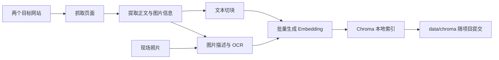
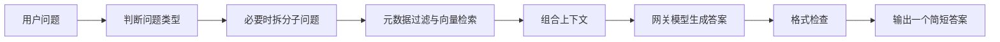

# Chatbot Challenge 2026 技术路线

本路线根据以下课件整理：

- `Slides/W0_Setup_and_Rules.pptx`
- `Slides/W1_RAG_Pipeline.pptx`
- `Slides/W2_Visual_and_Physical_Data.pptx`

当前仓库的评分入口是 `submission_repo/main.py`。课件中的 `trivia.py` 是旧名称，开发时以当前仓库为准。

## 1. 项目目标

构建一个关于 Tam Wing Fan Innovation Wing 的命令行问答机器人。评分程序会这样调用：

```powershell
python main.py "question"
```

程序必须只向标准输出打印一个简短答案，并满足以下约束：

- 每道题最多 30 秒。
- 回答时不能搜索互联网。
- 回答时不能调用外部 API，只能使用主办方提供的 Inno Wing 网关。
- 网站抓取、图片描述、切块和建库必须提前完成。
- 最终提交必须包含代码和 `data/chroma` 向量数据库。
- `.env` 和 API Key 绝对不能提交。

## 2. 总体架构

项目分成两个阶段。

### 构建阶段

构建阶段不计入每题 30 秒，可以花较长时间完成。



### 回答阶段

回答阶段每题必须在 30 秒内完成。



## 3. 问题等级与实现方式

| 等级 | 答案来源 | 主要实现 |
| --- | --- | --- |
| Lv1 | 模型常识 | 简洁 Prompt、稳定输出格式 |
| Lv2 | 网站文字 | 抓取、清洗、切块、向量检索 |
| Lv3 | 网站图片 | 收集图片、视觉描述、OCR、索引描述 |
| Lv4 | 多条信息推理 | 问题拆分、元数据过滤、计数与比较 |
| Lv5 | 现场环境 | 拍摄指定区域，沿用 Lv3 图片管线 |

初赛中 Lv1 和 Lv2 合计占 60%，Lv3 占 40%。第一优先级是先让文本 RAG 稳定得分，再投入图片和复杂推理。

## 4. 阶段一：建立可运行基线

### 工作内容

1. 激活项目环境。
2. 运行 `check_setup.py`。
3. 确认 `main.py` 可以启动。
4. 用 `dev_set.json` 记录初始答案和耗时。

```powershell
cd C:\Users\danie\Desktop\Coding\AI-Chatbot\submission_repo
.\.venv\Scripts\Activate.ps1
python check_setup.py
python main.py "What faculty does the Innovation Wing belong to?"
```

### 验收条件

- Python 包全部可以导入。
- Chat 和 Embedding 调用成功。
- `main.py` 只输出答案，不输出日志或字典。
- 保存一份 15 道开发题的基线结果。

## 5. 阶段二：抓取并清洗网站数据

主要文件：`submission_repo/build/scrape.py`

### 工作内容

1. 把主办方给出的两个网站填入 `SITES`。
2. 先检查 `/sitemap.xml`，存在时直接读取站点页面列表。
3. 没有 sitemap 时，只爬取同一域名的内部链接。
4. 使用页面的 `main`、`article` 或实际正文容器，排除导航栏和页脚。
5. 同时收集每张图片的：
   - 完整图片 URL
   - alt 文本
   - caption
   - 来源页面
6. 规范化空白并删除重复页面或重复正文。

### 输出

```text
data/pages.json
data/images.json
```

### 验收条件

- 随机检查至少 10 个页面，正文中没有重复菜单和页脚。
- 相对图片地址已通过 `urljoin` 转为完整 URL。
- 每条数据都能追溯到来源 URL。

## 6. 阶段三：文本切块与索引

主要文件：`submission_repo/build/index.py`

### 起始配置

```text
chunk size = 800 characters
overlap = 100 characters
k = 5
```

这只是课件给出的基线，不是最终最佳值。

### 工作内容

1. 先实现固定长度切块，确保流程端到端运行。
2. 再尝试按标题、段落和句子递归切块。
3. 把章节标题放到每个块的开头。
4. 对文本列表批量生成 Embedding，避免逐块调用。
5. 为每个块保存以下元数据：

```text
url
title
position
kind
page_type
year
```

6. 把原文、向量和元数据写入同一个 Chroma collection。

### 输出

```text
data/chroma/
```

### 验收条件

- 使用与查询阶段完全相同的 Embedding 模型。
- 查询结果中能看到距离、来源 URL 和原文。
- Chroma 距离越小表示越相关。
- 15 道题的检索结果中，至少部分 Lv1、Lv2 题包含正确证据。

## 7. 阶段四：完成基础 RAG 回答

主要文件：`submission_repo/bot/answer.py`

### 单题流程

1. 对问题生成一次 Embedding。
2. 从 Chroma 取回最相关的 `k` 个文本块。
3. 给每个块标注来源 URL。
4. 将检索上下文和问题交给 Chat 模型。
5. 清理模型输出，只保留最终答案。

### Prompt 结构

- 角色：回答 Innovation Wing 相关问题。
- 依据：以检索到的上下文为准。
- 格式：只返回答案，不加解释和开场白。
- 数字题：只输出数字或必要单位。
- 回退：即使证据不足也给出最佳猜测，因为比赛没有负分。
- 温度：设为 0，保证实验可重复。

### 验收条件

- `rag_answer(question)` 返回一个字符串。
- `rag_answer_batch(questions)` 保持问题数量和原顺序。
- 每题耗时低于 30 秒。
- 正确答案不会被额外的错误解释包围。

## 8. 阶段五：实验与调参

每次只修改一个变量，再重新评分。

### 推荐测试范围

| 参数 | 建议范围 |
| --- | --- |
| chunk size | 400 到 1200 字符 |
| overlap | chunk size 的 0% 到 20% |
| k | 3、5、8、10、15 |
| Prompt | 每次只修改一条指令 |

### 每轮记录

```text
日期
修改内容
chunk size
overlap
k
检索命中数 / 15
正确回答数 / 15
最慢耗时
```

判断方式：

- 检索命中率低：优先改抓取、清洗、切块或检索。
- 正确证据已经出现但回答仍错：再改 Prompt 或输出处理。
- 准确率提高但超过 30 秒：该改动不能使用。

## 9. 阶段六：网站图片管线

主要文件：`submission_repo/build/images.py`

### 工作内容

1. 下载 `data/images.json` 中的图片。
2. 把 alt 和 caption 直接加入文本资料。
3. 使用视觉模型描述每张图片。
4. 对小字或标牌增加本地 OCR，例如 Tesseract 或 PaddleOCR。
5. 缓存描述，避免每次重跑所有图片。
6. 把图片描述当成普通文本块写入同一个 Chroma 索引。

### 图片描述必须包含

- 房间或区域名称
- 物体及明确数量
- 所有可见文字的逐字抄录
- 物体之间的空间关系
- 有辨识作用的颜色和材料

无法辨认的文字应写成 `[unreadable]`，不要猜测。

### 输出

```text
data/descriptions.json
data/chroma/ 中 kind=image 的记录
```

### 验收条件

- 图片只在构建阶段描述一次。
- 回答问题时不再加载或发送图片。
- Lv3 问题能够通过普通文本检索找到图片描述。

## 10. 阶段七：复杂推理与 Lv4

### 问题拆分

一个问题涉及两个主题时，先拆成两个子问题，分别检索，再合并证据。

### 计数和比较

计数问题不能只依赖 top-k 向量检索。应先利用 `year`、`page_type`、`kind` 等元数据找到完整集合，再计数或比较。

### 路由

- 简单单事实问题：直接检索和回答。
- 多主题问题：拆分后并行检索。
- 数量、最大值、比较题：过滤完整集合后聚合。
- 不要让所有问题都经过多步推理，否则会浪费 30 秒预算。

### 验收条件

- 子问题的证据分别标注，模型能看到证据属于哪一部分。
- 独立子查询尽量并行执行。
- 复杂题的总耗时仍低于 30 秒。

## 11. 阶段八：现场数据与 Lv5

现场信息无法从网站获得，需要按照分配区域拍摄。

### 工作内容

1. 按主办方的区域分配拍摄现场。
2. 使用统一文件命名方式记录位置。
3. 确保照片能清楚看到数量、颜色、文字和空间关系。
4. 使用与网站图片相同的描述、OCR、缓存和索引流程。
5. 第一轮索引后，自拟 Lv5 问题测试。
6. 根据失败问题安排第二次补拍。

Lv3 和 Lv5 共用同一个图片管线和同一个 Chroma 索引，不需要建立第二套系统。

## 12. 最终验收与提交

### 功能检查

- 15 道 `dev_set.json` 问题全部运行。
- 分别记录 Lv1 到 Lv5 得分。
- 保存失败题作为后续工作清单。
- 增加 30 到 50 道自己的测试题，重点覆盖弱项。
- 每题记录运行时间。

### 提交检查

- 不修改评分入口 `main.py` 的调用契约。
- `.env` 没有进入 Git。
- Notebook 输出中没有 API Key。
- `requirements.txt` 保留固定的 ChromaDB 版本。
- `data/chroma` 已提交。
- 在全新的环境中安装依赖并完成一次测试。
- 运行时不访问网站或其他外部 API。
- 标准输出只有最终答案。

## 13. 建议时间表

| 日期 | 里程碑 |
| --- | --- |
| 16 Sep | 环境验证完成，建立基线 |
| 23 Sep | 完成两个网站的抓取和文本索引，Lv1、Lv2 开始得分 |
| 30 Sep | 已尝试网站图片处理，并记录失败原因 |
| 7 Oct | 完成分配区域的现场数据采集记录 |
| 14 Oct | 图片描述已索引，Lv3 开始得分 |
| 21 Oct | 提交代码和向量数据库参加初赛 |
| 28 Oct | 现场决赛 |

## 14. 当前最优先的三件事

1. 获得并确认两个目标网站 URL。
2. 完成 `build/scrape.py`，生成干净的 `pages.json` 和 `images.json`。
3. 在 API 网关可用后完成 `build/index.py`，建立第一版 `data/chroma`，然后立刻跑 15 道开发题。

第一版系统只需要完成简单、可测量的文本 RAG。先得到分数，再根据失败题逐步加入图片、元数据过滤和问题拆分。
